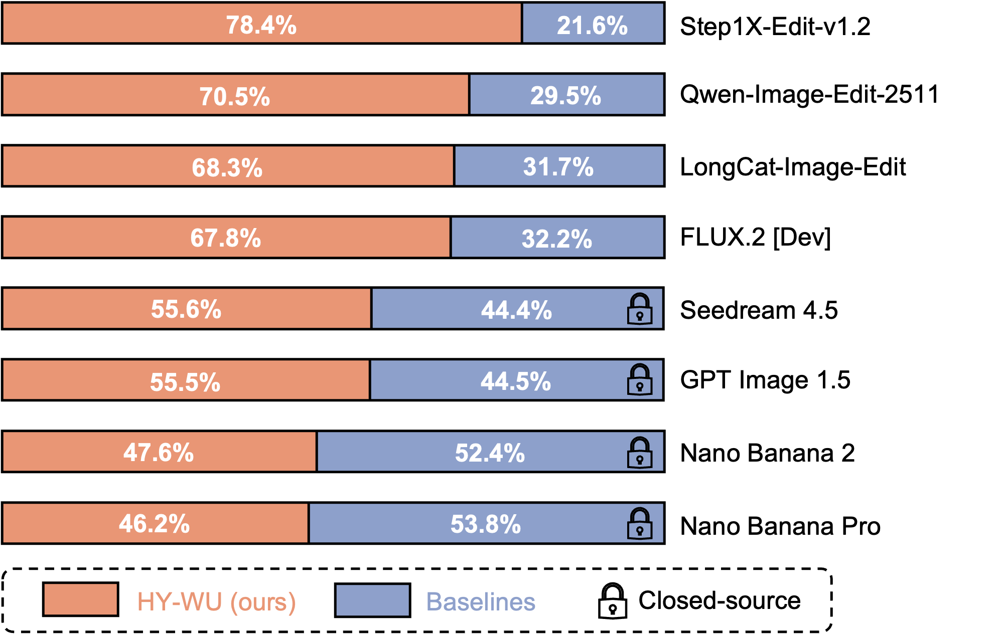

<div align="center">


# HY-WU (Part I): An Extensible Functional Neural Memory Framework and An Instantiation in Text-Guided Image Editing
</div>

<div align="center">
  
</div>

<div align="center">
  <a href=https://tencent-hy-wu.github.io/ target="_blank"></a>
  <a href=https://huggingface.co/tencent/HY-WU target="_blank"></a>
  <a href=https://github.com/Tencent-Hunyuan/HY-WU target="_blank"></a>
  <a href=https://arxiv.org/abs/2603.07236 target="_blank"></a>
  <a href=https://x.com/TencentHunyuan/status/2029644529578692723?s=20 target="_blank"></a>
  <a href=https://docs.qq.com/doc/DUVVadmhCdG9qRXBU target="_blank"></a>
</div>

<!-- <p align="center">
    👏 Join our <a href="./assets/WECHAT.md" target="_blank">WeChat</a> and <a href="https://discord.gg/ehjWMqF5wY">Discord</a> |
💻 <a href="https://hunyuan.tencent.com/chat/HunyuanDefault?from=modelSquare&modelId=Hunyuan-Image-3.0-Instruct">Official website(官网) Try our model!</a>&nbsp&nbsp
</p> -->

## 🔥 News
- **March 10, 2026**: **We are hiring Interns and Full-time Employees! 🚀** (Focus: Parameter Generation. Drop your CV via [victorkwang@global.tencent.com](mailto:victorkwang@global.tencent.com))
- **March 6, 2026**: 🎉 **[HY-WU](https://github.com/Tencent-Hunyuan/HY-WU)** open source - Inference code and model weights publicly available.

## 🗂️ Contents
- [🔥 News](#-news)
- [📖 Introduction](#-introduction)
- [✨ Key Features](#-key-features)
- [🖼 Showcases](#-showcases)
- [📑 Open-Source Plan](#-open-source-plan)
- [🚀 Usage](#-usage)
- [🧱 Memory Requirement](#-memory-requirement)
- [📊 Evaluation](#-evaluation)
- [📚 Citation](#-citation)

---

## 📖 Introduction

We propose HY-WU: a scalable framework for on-the-fly conditional generation of low-rank (LoRA) updates.
HY-WU synthesizes instance-conditioned adapter weights from hybrid image–instruction representations and injects them into a frozen backbone during the forward pass, producing instance-specific operators without test-time optimization.

<div align="center">
  
</div>

## ✨ Key Features

* 🧠 **Functional Neural Memory:**
HY-WU introduces a lightweight “neural memory” for AI. It generates conditioned model adapter per request (without finetuning!), enabling instance-level personalization while preserving the base model’s general capability.

* 🏆 **Scalable for Large Models:**
HY-WU remains practical for large foundation models (even at 80B parameters!). With structured parameter tokenization, the method naturally compatible with large-scale architectures.

* 🎨 **Strong Human Preference:**
HY-WU achieves high human preference win-rates against open-source models, exceeds strong closed-source baselines, and remains close to the latest Nano-Banana series.

## 🖼 Showcases

**Showcase 1: Cross-Domain Clothing Fusion**

<div align="center">
  
</div>

**Showcase 2: Creative Cosplay and Character Outfit Migration**

<div align="center">
  
</div>

**Showcase 3: High-Fidelity Face Identity Transfer**

<div align="center">
  
</div>

**Showcase 4: Seamless Outfit Transfer and Virtual Try-on**

<div align="center">
  
</div>

**Showcase 5: High-Quality Texture Synthesis**

<div align="center">
  
</div>

## 📑 Open-source Plan

- HY-WU
  - [x] Inference
  - [x] HY-Image-3.0-Instruct's checkpoint
  - [ ] Distilled checkpoint
  - [ ] Other models' checkpoint


## 🚀 Usage

#### 🏠 Clone the repository

```bash
git clone https://github.com/Tencent-Hunyuan/HY-WU.git
cd HY-WU
```

#### 📥 Install dependencies

```bash
pip install -r requirements.txt
```

#### 🔥 Play with the code

Directly run `infer.py`

```python
python infer.py
```

Or use the code below:

```python
from wu import WUPipeline

base_model_path = "tencent/HunyuanImage-3.0-Instruct"
pg_model_path = "tencent/HY-WU"

pipeline = WUPipeline(
    base_model_path=base_model_path,
    pg_model_path=pg_model_path,
    device_map="auto",
    moe_impl="eager",
    moe_drop_tokens=False,
)

prompt = "以图1为底图，将图2公仔穿的衣物换到图1人物身上；保持图1人物、姿态和背景不变，自然贴合并融合。"
# prompt_en = Using Figure 1 as the base image, replace the clothing on the character in Figure 1 with the outfit worn by the figurine in Figure 2. Keep the character, pose, and background of Figure 1 unchanged, ensuring the new clothing fits naturally and blends seamlessly.
imgs_input = ["./assets/input_1_1.png", "./assets/input_1_2.png"]

sample = pipeline.generate(prompt=prompt, imgs_input=imgs_input, diff_infer_steps=50, seed=42, verbose=2)

sample.save("./output.png")

```

#### 🎨 Interactive Gradio Demo

Launch an interactive web interface for easy image-to-image generation.

```bash
pip install gradio>=4.21.0

python gradio/app.py
```

> 🌐 **Web Interface:** Open your browser and navigate to `http://localhost:7680` or shared link.

</details>

## 🧱 Memory Requirement

| Base model param   | HY-WU param | Recommended VRAM        |
|--------------------| ----------- | ----------------------- |
| 80B (13B active)   | 8B          | ≥ 8 × 40 GB or 4 x 80GB |

Notes:
- Multi‑GPU inference is required for the base model.

## 📊 Evaluation

### 👥 **GSB (Human Evaluation)**

HY-WU substantially outperforms leading open-source models, and remain competitive with top-tier closed-source commercial systems.
While Nano Banana 2 and Nano Banana Pro achieve slightly higher overall scores (52.4\% and 53.8\%, respectively), the margin remains modest.

Given that these commercial systems are likely trained with substantially larger-scale backbones and proprietary data, the modest performance gap suggests that our operator-level conditional adaptation remains effective even under more constrained model scale.

<p align="center">
  
</p>


## 📚 Citation

If you find HY-WU useful in your research, please cite our work:

```bibtex
@article{wu2026hy-wu,
  title={HY-WU (Part I): An Extensible Functional Neural Memory Framework and An Instantiation in Text-Guided Image Editing},
  author={Tencent HY Team, Mengxuan Wu, Xuanlei Zhao, Ziqiao Wang, Ruicheng Feng, Atlas Wang, Qinglin Lu, and Kai Wang},
  journal={arXiv preprint arXiv:2603.07236},
  year={2026}
}
```
