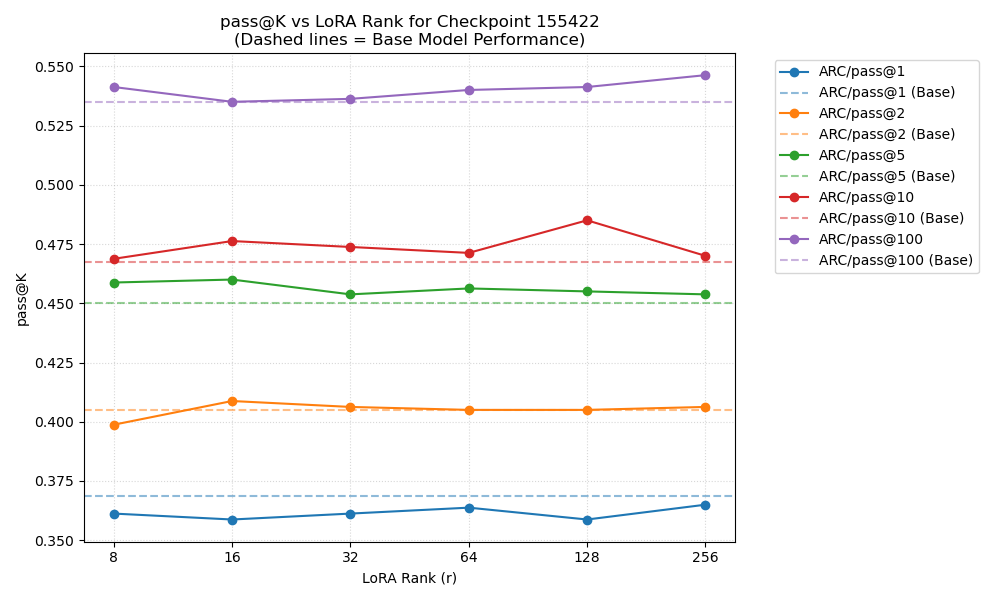
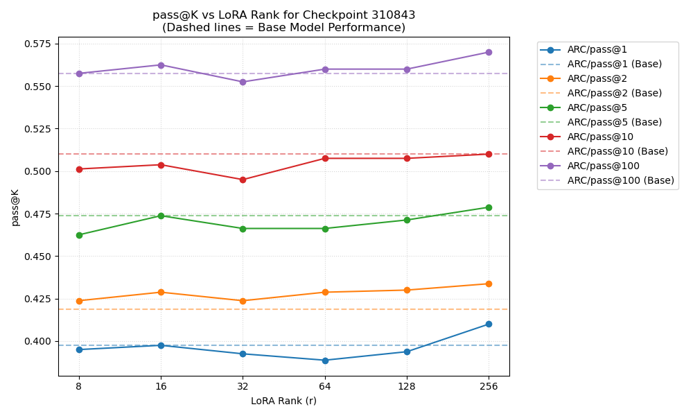

# LoRA Rank Search Analysis (With Baselines)

Here are the extracted `ARC/pass@k` performance metrics measured across varying LoRA ranks `r` from the log files in `logs/0320logs`. The evaluations were tested at `r = [8, 16, 32, 64, 128, 256]` for both checkpoints `155422` and `310843`.

*The horizontal dashed lines indicate the respective baseline performances of the exact same base model without any LoRA tuning (taken from `eval_0318_1121.log`).*

## Checkpoint 155422

## Checkpoint 310843

### Summary
* Check these plots to see if the points are consistently above the dashed horizontal line, signaling an improvement over the baseline.
* Look for the peak in the `ARC/pass@k` metrics (especially `pass@1` and `pass@2`) to determine which Rank offers the most generalization vs. memorization balance, and you can plug this optimal rank into your LR test script.
