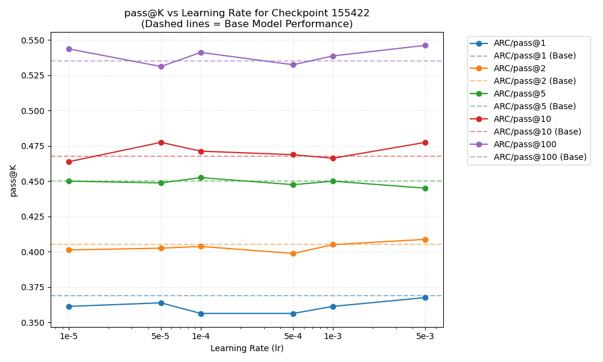
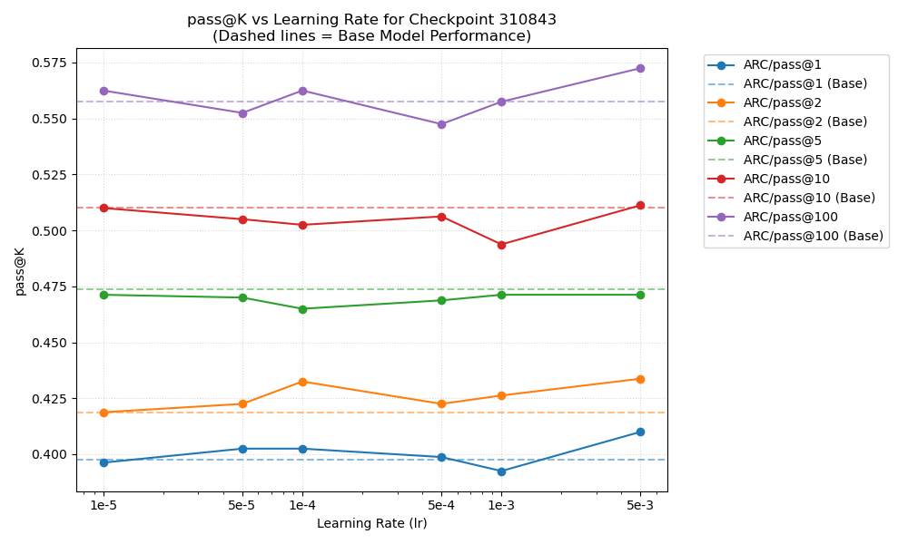

# LoRA Learning Rate Search Analysis (With Baselines)

Here are the extracted `ARC/pass@k` performance metrics measured across varying Learning Rates (`lr`) from the log files in `logs/lora_logs`. 

*The horizontal dashed lines indicate the respective baseline performances of the exact same base model without any LoRA tuning.*

## Checkpoint 155422

## Checkpoint 310843

### Summary
* Check these plots to find the peak performance on the learning rate curve.
* A learning rate that is too low will hover near the baseline or fail to converge, while a learning rate that is too high may cause training instability or catastrophic forgetting.
